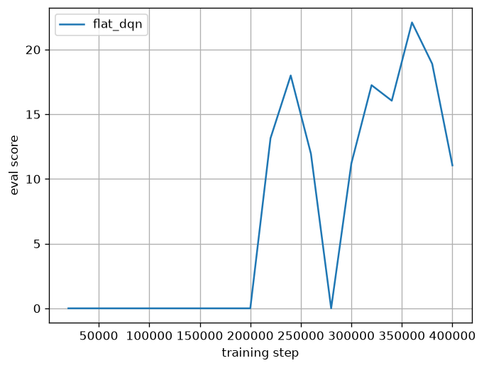
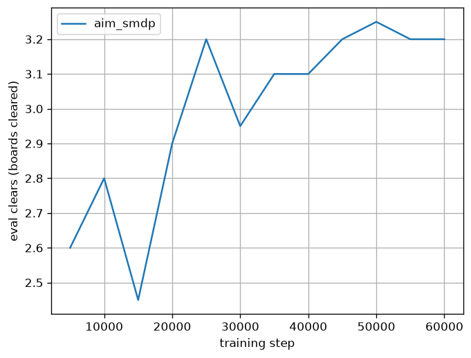
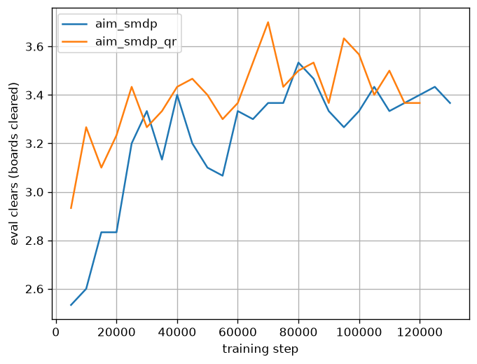

#  SI2 - Breakout

A Breakout game implementation using the `ai-game-framework`.

> **SI2 evaluation — start here.** Our autonomous RL agent and its full report are in
> **[Reinforcement Learning Agent — Project Report](#reinforcement-learning-agent--project-report-si2)**
> below. To **watch the trained agent play in three commands** (no training needed — a
> trained checkpoint ships in the repo), jump straight to
> **[Quick start: watch the trained agent](#quick-start-watch-the-trained-agent)**.

## Features
- Real-time backend server.
- Web-based viewer with Canvas API.
- Dummy agent (ball tracker).
- Manual agent (terminal-based A/D control).

## Setup & Running the Game

### 1. Prerequisites
- Python 3.10+ installed on your host.

### 2. Create and Activate Virtual Environment
Create a virtual environment (`venv`) to isolate dependencies:
```bash
python3 -m venv venv
source venv/bin/activate
```

### 3. Install Dependencies
Install the required packages (this will install the local `ai-game-framework` package in editable mode and `numpy`):
```bash
pip install -r requirements.txt
```

### 4. Run the Game Server
Start the backend server (which also serves the frontend web viewer):
```bash
python3 -m server.server
```

### 5. Open the Viewer
Open your web browser and navigate to:
```
http://localhost:8765/
```

### 6. Run the Agents
In a separate terminal (ensure the virtual environment is activated):

- **Dummy Agent (Ball Tracker)**:
  ```bash
  python3 -m agents.dummy_agent
  ```

- **Manual Agent (Terminal A/D control)**:
  ```bash
  python3 -m agents.manual_agent
  ```

## Development
The project structure:
- `server/`: Game logic, server implementation, and visualizer assets (inside `server/viewer/`).
- `agents/`: Autonomous and manual agent implementations.
- `tests/`: Game unit tests.

---

# Reinforcement Learning Agent — Project Report (SI2)

This section is the project report. It documents the autonomous Breakout agent(s)
we built, the architecture, the state/model/reward design, how to run everything,
and the experimental findings.

## Quick start: watch the trained agent

**Three commands to see our showpiece agent (the hierarchical SMDP policy) play live.**
A trained checkpoint is committed to the repo, so **no training is required** — `uv sync`
installs both the game server and the RL stack, and `uv` fetches the right Python itself.

```bash
# 1. One-time setup: create .venv and install everything (server + RL deps)
uv sync

# 2. Terminal 1 — start the game server and web viewer
.venv/bin/python -m server.server

# 3. Terminal 2 — run our trained hierarchical agent against it
.venv/bin/python -m breakout_rl.deploy.trained_agent \
    --mode hier --checkpoint checkpoints/aim_smdp/online_final.pt
```

Then open **<http://localhost:8765/>** in a browser to watch it play.

Other shipped checkpoints (same `server.server` running in terminal 1):

```bash
# Flat (reactive) DQN baseline
.venv/bin/python -m breakout_rl.deploy.trained_agent \
    --mode flat --checkpoint checkpoints/flat_dqn/online_final.pt

# Distributional QR-DQN high level (loads via the same hierarchical adapter)
.venv/bin/python -m breakout_rl.deploy.trained_agent \
    --mode hier --checkpoint checkpoints/aim_smdp_qr/online_final.pt
```

> No `uv`? Install with pip instead — `python3 -m venv .venv && .venv/bin/pip install -r
> requirements.txt -r requirements-rl.txt` (needs Python ≥ 3.14) — then use the same
> `.venv/bin/python …` commands above. The full command reference (training, evaluation,
> plots) is in [§2](#2-how-to-run).

## 1. What we built

Two agents that share one codebase (`breakout_rl/`):

1. **Flat DQN** — a from-scratch **Double + Dueling DQN with Prioritized Experience
   Replay (PER)**. A reactive policy that maps the full game observation directly to a
   paddle action (`NOOP`/`WEST`/`EAST`). This is the baseline "spine".
2. **Hierarchical SMDP agent** — the "showpiece". A **learned high-level policy** chooses
   a *contact region* (LEFT / CENTER / RIGHT third of the paddle) once per ball descent;
   a **physics-based low-level controller** then moves the paddle to make the ball strike
   that region. Trained with semi-Markov (options) Q-learning.

Both reuse the same network, replay buffer, observation builder, and rollout predictor.

On top of the hierarchy we then investigated two extensions (§9): a **distributional**
high-level learner (**QR-DQN**, which learns the *return distribution* per region instead
of a scalar mean) and a learning-free **model-based planner** (Monte-Carlo one-volley
lookahead) that serves as a model-based reference point for the learned policies.

## 2. How to run

**Just want to watch the agent play? See [Quick start](#quick-start-watch-the-trained-agent)
above — three commands against the shipped checkpoints, no training.** This section is the
full command reference for *reproducing the experiments* (training, evaluation, plots).

This project uses [`uv`](https://docs.astral.sh/uv/). The Python environment (incl.
`torch`, `gymnasium`, `tensorboard`, `pytest`) is declared in `pyproject.toml` /
`uv.lock`. A `requirements-rl.txt` mirrors the dependency list for pip users.

```bash
uv sync                                   # create .venv and install everything
.venv/bin/python -m pytest -q             # run the test suite (64 tests)
```

All commands below assume `.venv/bin/python` (no activation needed). Training the SMDP
policy to convergence takes ~30 min on an RTX 3080-class GPU; the trainer uses CUDA
automatically if available, otherwise it runs (slower) on CPU.

```bash
# --- Train the reactive flat DQN (writes checkpoints/flat_dqn/) ---
.venv/bin/python -m breakout_rl.train.train_dqn --config breakout_rl/configs/flat_dqn.yaml

# --- M3 aiming-authority probe (the gate experiment; CPU, ~7 min for 100 episodes) ---
.venv/bin/python -m breakout_rl.eval.probe_aiming_authority --episodes 100

# --- Train the hierarchical SMDP aim policy (writes checkpoints/aim_smdp/) ---
.venv/bin/python -m breakout_rl.train.train_aim --config breakout_rl/configs/aim.yaml

# --- Distributional variant: QR-DQN high level (writes checkpoints/aim_smdp_qr/) ---
.venv/bin/python -m breakout_rl.train.train_aim --config breakout_rl/configs/aim_qr.yaml

# --- Multi-seed training + comparison table (random / flat DQN / SMDP / QR-DQN / planner) ---
bash scripts/train_seeds.sh
.venv/bin/python -m breakout_rl.eval.evaluate --episodes 30 --seeds 3
.venv/bin/python -m breakout_rl.eval.plot_curves --pattern "checkpoints/flat_dqn*/log.csv" --out docs/curves_flat_dqn.png

# --- Deploy a trained agent against the live WebSocket server ---
.venv/bin/python -m server.server                                   # terminal 1
.venv/bin/python -m breakout_rl.deploy.trained_agent --mode flat \
    --checkpoint checkpoints/flat_dqn/online_final.pt               # terminal 2
.venv/bin/python -m breakout_rl.deploy.trained_agent --mode hier \
    --checkpoint checkpoints/aim_smdp/online_final.pt               # hierarchical
# then open http://localhost:8765/
```

## 3. Architecture

The central design decision is to **train headless**: we import the pure, synchronous
`server.logic.Breakout` directly into a Gymnasium environment, so training runs at
thousands of steps/sec instead of being throttled by the 30 fps WebSocket loop. The
WebSocket `BaseAgent` is used only for deployment.

- **`breakout_rl/env/breakout_env.py`** — `BreakoutEnv(gym.Env)`. One step = apply action
  → `game.update(1/30)` → compute reward. `Discrete(3)` actions, `Box(23)` observation.
- **`breakout_rl/physics/predictor.py`** — `predict_landing(game)`. The ball-landing
  predictor *is the simulator itself*: it clones the game and rolls `update()` forward to
  the paddle line. This is **bit-exact** with the real environment (identical wall and
  brick collisions), so there is no separate, drift-prone physics model to maintain.
- **`breakout_rl/env/observation.py`** — `ObservationBuilder`, **shared by training and
  deployment** so the two cannot skew (guarded by `tests/test_observation_parity.py`).
  Velocity is unavailable on the wire, so it is recovered by finite difference over the
  **measured** `dt`.
- **`breakout_rl/env/high_level_env.py`** — `HighLevelEnv`, the SMDP options wrapper.
- **`breakout_rl/controllers/aim_controller.py`** — the physics-based low-level controller.

## 4. State representation (23-dim vector)

Built only from the `get_state()` wire format (positions, not internal velocity):

| idx | feature | normalization |
|---|---|---|
| 0 | paddle x | `paddle_x / (width - paddle_width)` |
| 1 | ball x | `ball_x / width` |
| 2 | ball y | `ball_y / height` |
| 3 | ball vx | finite-difference `Δx/dt`, scaled by `1/300` |
| 4 | ball vy | finite-difference `Δy/dt`, scaled by `1/300` |
| 5 | lives | `lives / 3` |
| 6 | bricks remaining | `count / 16` |
| 7–22 | brick occupancy | 16-dim 0/1 grid (which bricks are alive) |

The flat agent uses exactly this 23-dim vector. The hierarchical SMDP agent appends **one
extra feature** (`HIGH_OBS_DIM = OBS_DIM + 1`): the signed offset of the surviving-brick
centroid from the ball, normalized by width, so the high-level policy can aim toward where
bricks remain (see §9, "Endgame aiming").

## 5. Network and reward

- **Network** (`breakout_rl/agents/networks.py`): a **Dueling MLP** — a 2-layer ReLU torso
  feeding separate value `V(s)` and advantage `A(s,a)` heads, combined as
  `Q = V + (A − mean_a A)`. Trained with **Double DQN** targets and **PER**-weighted MSE.
- **Reward** (`breakout_rl/env/rewards.py`):
  - *Event reward*: `+score_delta` per step (i.e. +3/brick, +100/board clear), `−30` on
    losing a life, an extra `−50` on game over, and a small `−0.01` step cost.
  - *Potential-based shaping (PBRS)*: `Φ(s) = −|paddle_center − predicted_landing_x| / width`
    while descending, `0` while ascending and `0` on terminal states. Added as
    `F = γ·Φ(s') − Φ(s)`. PBRS is **policy-invariant** (it cannot change the optimal
    policy), so it accelerates learning without biasing the solution — the terminal-`0`
    rule and the telescoping identity are unit-tested.

## 6. Curriculum

Two stages (`breakout_rl/train/curriculum.py`): Stage 1 is *easy* (paddle width 120, ball
speed 200) to bootstrap; Stage 2 switches to the *real* difficulty (width 80, speed 300)
and runs long enough that the final evaluation reflects real conditions.

For the SMDP agent there is a subtlety: difficulty parameters are applied only on
`env.reset()`, but the aim controller almost never drops the ball, so games would otherwise
never end and the env would stay frozen on stage-1 settings forever. We therefore cap each
episode at `max_episode_steps` *primitive* steps (`aim.yaml`), forcing a reset so the stage-2
parameters actually take effect past the switch — visible as the step up in the SMDP curve
at option 20k (§9).

## 7. Evaluation metrics and the M3 aiming-authority gate

Plain survival/score **saturate** and fail to discriminate good agents, so we report
**board-clears** and **bricks-per-life** as the primary metrics, against baselines
(random, analytic-center, flat DQN, hierarchical), over multiple seeds.

Before committing to the full hierarchy we ran a **gate experiment** (`probe_aiming_authority.py`)
comparing three scripted policies — all of which *move the paddle to intercept the ball*,
differing only in **which third** of the paddle the ball contacts:

| policy | board clears | bricks/life |
|---|---|---|
| center (always bounce straight up) | 0.24 | 5.01 |
| random region | 2.31 | 15.79 |
| oracle region (greedy 1-volley brute force) | 2.09 | 14.57 |

*(100 episodes, seed 0, real difficulty.)*

**Findings.** (1) **Aiming authority is large**: steering the contact region gives ~**3×**
the bricks-per-life and ~**9×** the clears of the center-only baseline (oracle is **+191%**
over center, far above the +25% gate threshold). A straight-up bounce just re-breaks the
same vertical column; spreading the bounce angle covers the whole board. (2) The greedy
**oracle is *not* better than random** region choice — the stochastic ±bounce band
(LEFT ≈ −45°…−15°, CENTER ≈ ±5°, RIGHT ≈ 15°…45°) means precise per-volley optimization
does not pay off; what matters is simply *not always going straight up*. The implication
for the learned hierarchy: its value must come from **board-aware, multi-step credit
assignment** (it observes the 16-brick occupancy grid and is trained with SMDP backups),
not from myopic single-volley aiming.

> **Note on a corrected decision-point detector.** The original plan detected a "decision
> point" via a velocity sign-flip (`prev_vy ≤ 0 and vy > 0`). In this **gravity-free**
> physics the ball's velocity only flips at collisions (all above `y=140`), so that test
> *never fired* and the region was never re-chosen — every probe policy collapsed to
> "center". We replaced it with a **downward crossing of the decision line**
> (`prev_ball_y ≤ 140 < ball_y`, descending), matching the spec's intent ("clean descent
> below the brick field"). This is used in both the probe and `HighLevelEnv`; SMDP option
> lengths are now sane (k ≈ 60–80 primitive steps per option).

## 8. Hyperparameters

From `breakout_rl/configs/flat_dqn.yaml` (flat) and `aim.yaml` (SMDP):

| | flat DQN | SMDP aim |
|---|---|---|
| horizon | 400k steps | ≤200k options (early-stopped) |
| γ | 0.99 | 0.99 |
| learning rate | 1e-3 | 5e-4 |
| hidden units | 128 | 128 |
| replay capacity | 100k | 50k |
| batch size | 128 | 128 |
| target sync | every 2000 | every 1000 |
| ε schedule | 1.0 → 0.05 over 100k | 1.0 → 0.05 over 40k |
| PER β | 0.4 → 1.0 | 0.4 → 1.0 |
| curriculum switch | step 120k | option 20k |
| reward | score / −30 life / −50 game-over / −0.01 step | same + −2.0 empty-volley |
| early stop | — | patience 10 evals / Δ 0.02 / warmup 40k |

The SMDP run uses **plateau early stopping** (`breakout_rl/train/early_stop.py`): it trains
up to the 200k cap but halts once the eval metric (board-clears + `0.01·`bricks/life as a
fine tiebreaker) has not improved by `>0.02` for 10 consecutive evals past a 40k warmup, and
the **best-eval** checkpoint — not the last — is saved as `online_final.pt`.

## 9. Training curves and final comparison

Full runs: the **flat DQN for 400k steps** and the **SMDP aim policy** trained to
convergence under plateau early stopping (130k options, peaking ~80k, ≈30 min on an RTX 3080
Laptop GPU). We then add two extensions evaluated on the *same* held-out harness: a
**distributional QR-DQN** high level (identical SMDP setup, auto-stopped at **120k options**)
and a learning-free **model-based MC planner**. Both training and held-out evaluation seed
everything; evaluation uses held-out seeds (`10_000 + step`).

### Learning curves





- **Flat DQN** (`docs/curves_flat_dqn.png`, eval *score* vs. step): essentially flat at ~0
  for the first ~200k steps — the reactive policy needs a lot of experience before it
  reliably intercepts and scores under the real difficulty — then a **noisy** climb
  (13.2 at 220k, peak **22.1 at 360k**, 11.05 at 400k). The large step-to-step swings are
  characteristic of a high-variance reactive value function.
- **SMDP aim** (`docs/curves_aim_smdp.png`, eval *board-clears* vs. option): a clean,
  low-variance rise — **2.6 → ~3.3** over the first ~40k (with the **curriculum switch at
  20k**), then a climb to a peak **≈3.53 around 80k**, after which it **plateaus** (3.3–3.4)
  through the early stop at **130k**. Far fewer samples than the flat agent for a stronger
  policy, because each SMDP backup credits a whole volley.

| eval @ option | 10k | 30k | 40k | 50k | 70k | 80k | 100k | 120k | 130k |
|---|---|---|---|---|---|---|---|---|---|
| board-clears | 2.60 | 3.33 | 3.40 | 3.10 | 3.37 | **3.53** | 3.33 | 3.40 | 3.37 |

- **QR-DQN vs DQN** (`docs/curves_aim_smdp_qr.png`, both SMDP high levels, eval *board-clears*
  vs. option): the distributional learner (orange) sits **above** the scalar DQN (blue) for
  most of training — a **warmer start** (2.93 vs. 2.53 at 5k) and a higher peak
  (**3.70 at 70k** vs. 3.53 at 80k) — i.e. better **sample efficiency**, before both settle
  into the same 3.3–3.5 plateau and the **same held-out ceiling** (3.40, below). Modelling
  the per-region *return distribution* (the spread comes from the stochastic bounce) speeds
  learning but does **not** raise the ceiling — that is set by the controller (§7), not the
  value representation.

### Final comparison (held-out, 30 episodes × 3 seeds, equal 4000-primitive-step budget)

All agents are scored over the **same primitive-step budget** so the hierarchy's longer
options don't give it extra game time (the high-level driver accumulates `info["k"]`).

| agent | clears (mean±std) | bricks/life | score |
|---|---|---|---|
| random | 0.00 ± 0.00 | 1.69 | 0.0 |
| flat DQN | 2.36 ± 0.36 | 4.19 | 21.4 |
| hierarchical — SMDP DQN | 3.40 ± 0.00 | 20.91 | 586.2 |
| hierarchical — SMDP QR-DQN | 3.40 ± 0.03 | 21.05 | 574.3 |
| **model-based MC planner** | **3.72 ± 0.09** | **22.38** | **621.1** |

**Findings.** Every region-steering agent **crushes** the flat DQN: the hierarchical
learners deliver **+44%** board-clears, **5× the bricks-per-life**, and **~27× the game
score** of the flat baseline, at near-**zero cross-seed variance** (±0.00–0.03 clears vs.
±0.36), because the physics aim controller intercepts the ball almost deterministically while
the high level only has to decide *where to send it*. The flat agent's low score (21.4)
reflects that it loses its lives quickly; the steering agents survive the full step budget
and keep breaking bricks (≈63 bricks + board-clear bonuses). Within the steering agents the
spread is small and bounded: the scalar and distributional learners **tie at 3.40 clears**,
and the model-based planner tops the table at **3.72** — all three in a tight **3.4–3.7**
band. This sharpens the §7 picture: the decisive factor is *steering the contact region at
all* (vs. the center-only 0.24 baseline), after which the coarse 3-region, uniform-±bounce
controller caps how much further **any** method — distributional value or exhaustive
per-volley search — can push.

**Endgame aiming (brick-centroid feature + empty-volley penalty).** An early agent tended to
*corner-camp* in the endgame — driving the ball into a wall so its steep ricochet flung it
across the board — instead of aiming directly at the surviving bricks. Two learned-policy
changes address this: the high-level observation gains a **brick-centroid offset** feature
(signed direction from the ball to the surviving-brick centroid, so `HIGH_OBS_DIM = OBS_DIM+1`)
and an option that breaks **zero bricks** now incurs a `waste_penalty` (−2.0). Combined with
training to convergence under early stopping (auto-stopped at **130k options**, peak ~80k,
best-eval checkpoint kept), this lifted clears **3.21 → 3.31 → 3.40** and bricks/life
**19.79 → 20.58 → 20.91** across the three iterations. The remaining gap is **fundamental**,
not a training shortfall: the controller's coarse 3-region aim and the uniform ±bounce
randomness make the last-brick endgame a stochastic search (see §7), so the converged policy
sits near the achievable ceiling for this controller.

*(Raw numbers in `checkpoints/comparison.csv`. The hierarchical `score` is now reported by
`evaluate_hierarchical`; earlier it defaulted to 0.0 because that metric was not populated.)*

### Distributional value — QR-DQN

The high level is also implemented as a **distributional** agent (`agents/qr_dqn_agent.py`):
instead of a scalar `Q(s, region)` it predicts **N = 51 quantiles** of the SMDP return
distribution per region (`QRDuelingMLP`, a per-quantile dueling head), trained with the
**quantile-Huber loss** at fractions `τ_i = (i + 0.5)/N`. Everything else is held identical to
the scalar agent — **Double-DQN** next-action (by mean-quantile argmax), **PER**, and the SMDP
`γ^k` discount carried into the distributional Bellman target — so the comparison isolates the
value representation; the greedy action is the argmax of the mean quantile.

The result (curve above, and the 3.40 tie in the table) is the textbook one: the
distributional target is a **richer learning signal** — the return spread induced by the
uniform-±bounce is modelled rather than averaged away — so QR-DQN **learns faster** and peaks
higher, but converges to the **same held-out ceiling** as scalar DQN. Distributional RL buys
sample efficiency here, not a better final policy, because the limit is the controller.

### Model-based planning baseline — MC planner

`agents/planner.py` is a **learning-free** high level: at each decision point it clones the
live game and, for each of the three contact regions, **Monte-Carlo rolls the upcoming volley
forward** (`n_samples = 16`) through `HighLevelEnv`'s *own* dynamics — same controller, same
brick-counting, same option boundary — then commits to the region with the **highest expected
bricks broken** that volley. Because the rollouts reuse the real simulator there is no separate
model to drift; the planner simply trades **decision-time compute** (3 × 16 = 48 rollouts per
decision) for the experience the RL agents amortize into a single forward pass.

It is the **strongest** policy in the table (**3.72 clears**, +0.32 over the learned agents),
yet still squarely inside the 3.4–3.7 band — so even exhaustive one-volley search cannot escape
the controller ceiling, only approach it more tightly. Note this is a purely *myopic*
(single-volley, greedy) policy beating the multi-step learners, which is why we soften the
original §7 wording: the gain over center-only is about *steering the region at all*, not about
look-ahead depth.

**A measurement bug we caught (and fixed).** The server's paddle bounce draws from the global
`random` stream, so the planner snapshots/restores it to keep the live episode reproducible.
Done naively, that *also* makes the volley which actually executes draw its bounce from the
**same RNG state the first rollout started from** — so the planner partly *peeks* at the
realized outcome instead of estimating an expectation. The fix is to reseed the rollouts to an
**independent per-decision sub-stream** (still restoring the execution stream); the table
reports the **decorrelated, honest** planner. A controlled check (`scripts/planner_analysis.py`)
quantifies it:

| rollouts/region (n) | shared-RNG (naive) | decorrelated (honest) |
|---|---|---|
| 1 | 3.70 | 3.25 |
| 16 | 3.90 | 3.75 |

Two reads at once: more rollouts sharpen the expected-breaks estimate (**3.25 → 3.75** as
n: 1 → 16), and the RNG peek inflates clears by **+0.45 at n = 1**, shrinking to **+0.15 at
n = 16** (averaging dilutes the single correlated sample). *(These are 20-episode single-seed
probes; the 3.72 in the main table is the 30 × 3 held-out figure.)*

**Deploy check & a train/deploy parity bug.** The deploy adapter
(`breakout_rl/deploy/trained_agent.py`) shares the exact observation builder used in training
(guarded by `tests/test_observation_parity.py`, so the wire and training observations match
bit-for-bit) and loads either checkpoint to act against the live WebSocket server via the §2
commands. Shipping it surfaced a subtle bug worth recording: the deploy loop originally
detected a high-level decision point with its *own* predicate (a ball apex below the decision
line) which, in this gravity-free physics, **never fired** for brick-reaching volleys — so the
region stayed frozen at its CENTER default and the **trained policy was never actually
consulted in the viewer** (the agent looked passive and left-biased, while the offline eval
numbers were correct all along). The fix mirrors the observation-parity guard: training and
deploy now call **one shared predicate**, `crossed_decision_line(prev_ball_y, ball_y, vy)`
(`env/high_level_env.py`), so the two can never silently diverge again. With it the viewer
agent re-chooses a region on every descent and plays as the table predicts.

## 10. Reproducibility

- The exact `server/logic.py` commit used for an experiment is pinned in each config's
  `logic_commit` field (stamped by `scripts/record_commit.py`).
- Training seeds everything (`random`, `numpy`, `torch`); evaluation uses **held-out**
  seeds (`10_000 + step`) disjoint from training.
- Intermediate checkpoints / TensorBoard logs are gitignored; only `online_final.pt`
  checkpoints are kept (force-added).

## 11. Upstream contribution — PR: fix brick-collision resolution

A reviewing pass over `server/logic.py` — backed by two glitches we then saw live in the
viewer — found a real collision bug with two compounding causes. Below is the proposed
pull request to `mariolpantunes/si2-breakout` (verified locally; **not** applied to the
branch used for the reported experiments — see the caveat at the end).

**Title:** `fix: robust brick-collision resolution (resolve every overlap + face-aware reflection)`

### Symptom
Two related glitches, both observed live in the viewer:

1. **Two bricks, one removed.** When the ball overlaps **two bricks in the same physics
   frame** — e.g. straddling the ~10 px gap between two bricks in a row — only one is
   removed and, in a reproducible case, the ball **passes straight through the second**
   without breaking it or bouncing.
2. **Wrong-axis reflection / row tunnelling.** A ball **rising from below** strikes a
   brick but rebounds off a *vertical* (left/right) face — `vx` flips while `vy` is left
   unchanged — so it keeps moving up, breaks the brick, and **continues into the brick one
   row above** instead of bouncing back down.

### Root cause (`server/logic.py`, the brick-collision block of `update()`)
Two issues compound:

1. **First-in-array resolution.** The hit brick is chosen as `np.where(overlap)[0][0]` —
   the *lowest index*, not the brick actually being contacted — and only that single brick
   is deactivated, so a genuinely-overlapped neighbour survives the frame (symptom 1).
2. **Penetration-only axis selection.** The reflection axis is picked purely by
   `overlap_x < overlap_y` on the *post-move* position. After one discrete step a fast or
   angled ball can sit deeper on the wrong axis than the face it actually crossed: a ball
   rising from below a brick, slightly off-centre, ends the frame with a small horizontal
   overlap and a larger vertical one, so the code flips `vx` and leaves `vy` negative — the
   ball tunnels up into the next row (symptom 2). Penetration depth alone does not encode
   *which face the ball came through*. (A naive `and ball_vx != 0` guard does **not** fix
   this — the offending ball has `vx ≠ 0`; the axis choice itself is wrong.)

### Reproduction (deterministic; uses no RNG)
```python
from server.logic import Breakout

# (1) two-brick straddle — ball straight up in the gap overlaps bricks 0 and 1
g = Breakout()
for b in g.bricks:
    b.active = (b.index in (0, 1))   # row-1 bricks 0 (105–175) and 1 (185–255)
g._sync_bricks_to_numpy()
g.ball_x, g.ball_y, g.ball_vx, g.ball_vy = 180.0, 83.0, 0.0, -100.0
g.update(0.05)
print(g.bricks[0].active, g.bricks[1].active, g.ball_vy)
# BEFORE FIX: False  True  -100.0   <- brick 1 survives, ball keeps going up (tunnels)
# AFTER  FIX: False  False +100.0   <- both break, ball bounces down

# (2) wrong-axis reflection — ball rising from BELOW brick 11, slightly off-centre
g = Breakout()
for b in g.bricks:
    b.active = (b.index in (11, 5))  # row-3 idx 11 (x 105–175) and the row-2 idx 5 above it
g._sync_bricks_to_numpy()
g.ball_x, g.ball_y, g.ball_vx, g.ball_vy = 100.0, 140.0, 80.0, -400.0
g.update(0.05)
print(g.bricks[11].active, g.bricks[5].active, g.ball_vy)
# BEFORE FIX: False  True  -400.0   <- vx flipped, ball keeps rising toward the row above
# AFTER  FIX: False  True  +400.0   <- vy flipped, ball bounces down off the contacted brick
```

### Fix
Two changes. First, capture the **pre-move position** at the top of `update()`:

```python
prev_ball_x, prev_ball_y = self.ball_x, self.ball_y   # for face-aware brick reflection
self.ball_x += self.ball_vx * dt
self.ball_y += self.ball_vy * dt
```

Then, in the brick-collision block, resolve **every** overlapped brick and choose the
reflection axis from the face the ball **actually crossed this frame** (a swept test on
`prev_*`), not from raw penetration depth:

```python
overlap_idxs = np.where(overlap)[0]
r = self.ball_radius

# contact brick = least-penetrated (the last face crossed), not array order
ox_all = np.minimum(self.ball_x + r - lefts, rights - (self.ball_x - r))
oy_all = np.minimum(self.ball_y + r - tops, bottoms - (self.ball_y - r))
pen = np.minimum(ox_all, oy_all)
pen[~overlap] = np.inf
hit_idx = int(np.argmin(pen))

# deactivate EVERY overlapped brick so the ball cannot tunnel through a neighbour
for hit in overlap_idxs:
    bidx = int(self.brick_array[hit, 5])
    self.brick_array[hit, 4] = 0.0
    self.bricks[bidx].active = False
    self.score += 3

b_left, b_right = lefts[hit_idx], rights[hit_idx]
b_top, b_bottom = tops[hit_idx], bottoms[hit_idx]

# axis = the face the ball crossed this frame (swept test on the pre-move position)
crossed_vert  = (prev_ball_y - r >= b_bottom) or (prev_ball_y + r <= b_top)
crossed_horiz = (prev_ball_x - r >= b_right)  or (prev_ball_x + r <= b_left)
if crossed_vert and not crossed_horiz:
    self.ball_vy = -self.ball_vy
elif crossed_horiz and not crossed_vert:
    self.ball_vx = -self.ball_vx
else:  # genuine corner: fall back to min-penetration, flip only a component moving INTO the brick
    overlap_x = min(self.ball_x + r - b_left, b_right - (self.ball_x - r))
    overlap_y = min(self.ball_y + r - b_top, b_bottom - (self.ball_y - r))
    if overlap_x < overlap_y and self.ball_vx != 0.0:
        self.ball_vx = -self.ball_vx
    else:
        self.ball_vy = -self.ball_vy
```

### Regression tests (add to `tests/test_logic.py`)
```python
def test_simultaneous_two_brick_overlap_breaks_both_and_bounces():
    g = Breakout()
    for b in g.bricks:
        b.active = (b.index in (0, 1))
    g._sync_bricks_to_numpy()
    g.ball_x, g.ball_y, g.ball_vx, g.ball_vy = 180.0, 83.0, 0.0, -100.0
    g.update(0.05)
    assert g.bricks[0].active is False
    assert g.bricks[1].active is False          # neighbour no longer survives
    assert g.ball_vy > 0                         # bounces down, does not tunnel

def test_upward_ball_reflects_vertically_not_through_row():
    g = Breakout()
    for b in g.bricks:
        b.active = (b.index in (11, 5))
    g._sync_bricks_to_numpy()
    g.ball_x, g.ball_y, g.ball_vx, g.ball_vy = 100.0, 140.0, 80.0, -400.0
    g.update(0.05)
    assert g.bricks[11].active is False          # the contacted brick breaks
    assert g.bricks[5].active is True            # the row above is untouched
    assert g.ball_vy > 0                         # ball bounces DOWN, does not tunnel up a row
```

### Verification & impact
Locally verified on a patched copy: both reproductions now reflect the ball **downward**
and stop at the contacted brick; the existing single-brick collision test
(`test_brick_collision_and_scoring`) is unchanged (score 103, brick deactivated,
board-clear respawn); and an ordinary left-face hit still flips `vx` (no over-correction).
The change is small, has no extra dependencies, and only alters behaviour in the
multi-overlap / fast-angled-approach edge cases.

**Caveat (reproducibility):** this fix changes game dynamics, so it is **not** merged into
the branch used for the reported experiments. If it is accepted upstream and adopted here,
re-pin `logic_commit` (`scripts/record_commit.py`) and re-run training before updating the
numbers in §9.

## 12. Repository layout (RL)

```
breakout_rl/
  constants.py            action/region enums + fixed constants
  physics/clone.py        deep-enough game clone for rollouts
  physics/predictor.py    bit-exact ball-landing predictor
  env/observation.py      shared 23-dim observation builder
  env/rewards.py          event reward + PBRS potential
  env/breakout_env.py     Gymnasium env (flat DQN)
  env/high_level_env.py   SMDP options wrapper (hierarchy)
  agents/replay.py        prioritized experience replay
  agents/networks.py      dueling MLP (+ per-quantile dueling head for QR-DQN)
  agents/dqn_agent.py     Double-DQN agent (reused by both levels)
  agents/qr_dqn_agent.py  distributional QR-DQN agent (quantile-Huber loss)
  agents/planner.py       model-based Monte-Carlo one-volley planner
  controllers/aim_controller.py   physics-based low-level aim
  train/                  curriculum + flat/SMDP training entrypoints
  eval/                   metrics, multi-seed comparison, probe, plots
  deploy/trained_agent.py WebSocket deploy (flat + hierarchical)
  configs/                flat_dqn.yaml, aim.yaml, aim_qr.yaml
tests/                    64 tests covering every module
```